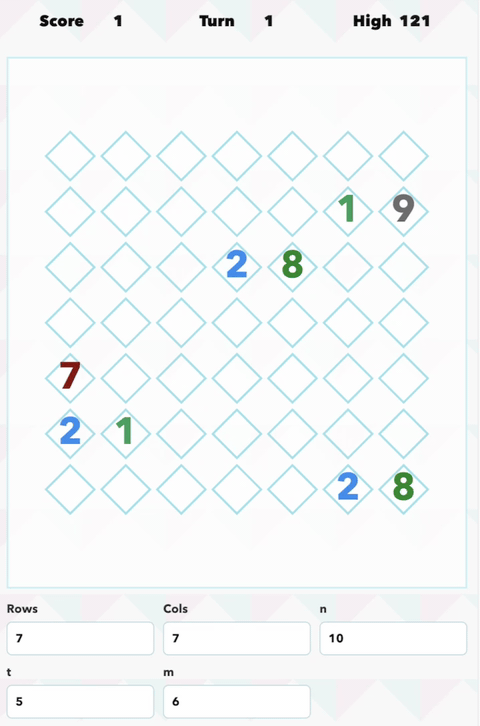

# decodoku-remake

A game related to the decoding task of topological quantum codes. It is a reimplementation based on [the same game from Dr James Wootton](https://decodoku.itch.io/decodoku), where players clean up anyons on a lattice before error chains connect opposite boundaries.

This remake also focuses on making the game easy to play from scripts. Alongside the browser interface, it exposes a local JSON API and example Python players so decoding strategies can inspect the board state, submit moves, and be tested repeatably.

## Demo



[Watch the MP4 version](script_play_ex.mp4).

## Rules

The board is a rectangular grid of plaquettes. Each plaquette stores a charge in `Z_n`; charge `0` means the plaquette has no active anyon.

These rules are a game-level approximation of real quantum error correction on surface codes, not a faithful simulator of the physical setup or the full decoding problem. In particular, values such as `Z_10` are useful here for gameplay and experiments, but real surface-code implementations generally do not use `Z_10` anyons.

Errors create neighboring anyons. An error chooses an edge between two neighboring plaquettes, adds `+k` to one endpoint, and adds `-k mod n` to the other endpoint. If both endpoints are nonzero after the update, they are marked as related and shown as actively connected.

On each player turn, choose a nonzero source plaquette and slide its full charge into an orthogonally neighboring target plaquette. The source becomes `0`, and the target becomes `target + source mod n`. If the target becomes `0`, the anyons annihilate there.

Anyons are related once they share history. Error-created endpoint anyons are related. A move also relates the moved source anyon with any active anyon already at the target. Relatedness can remain even after the visible lattice connection disappears.

The game ends when active related anyons touch opposite boundaries:

- `left-right`: at least one related active group touches both the left and right board edges.
- `top-bottom`: at least one related active group touches both the top and bottom board edges.

After every legal move, the turn and score each increase by `1`. Game over is checked immediately after the move; if the move already ended the game, the scheduled error burst is skipped. Otherwise, every `t` turns, `m` random errors are spawned and game over is checked again.

## Run

```sh
npm install
npm run dev
```

Open `http://127.0.0.1:5173`.

## Python API

The Vite dev server also exposes a local JSON API:

```sh
GET  /api/state
POST /api/new-game
POST /api/reset
POST /api/move
```

The state response exposes only `charges`, `turn`, `score`, `gameOver`, `winReason`, and `config`.

```python
import requests
import numpy as np

state = requests.post(
    "http://127.0.0.1:5173/api/new-game",
    json={"rows": 8, "cols": 8, "n": 10, "t": 5, "m": 6, "seed": "demo"},
).json()

charges = np.array(state["charges"], dtype=int)
```

See `examples/python_player.py` for a minimal move example.

## Baseline strategy

`examples/baseline_strategy.py` runs a deterministic visible-state player against the local API:

```sh
npm run dev
python3 examples/baseline_strategy.py --seed baseline
```

The baseline scores every legal one-step move. It strongly prefers immediate annihilation with a complementary neighboring charge, otherwise moves charges toward the nearest visible complement, avoids merging non-complementary visible charges, and nudges boundary charges inward.

To watch Python-driven moves in the browser, open the app with API watch mode enabled:

```sh
open http://127.0.0.1:5173/?watchApi=1
python3 examples/baseline_strategy.py --seed watched-python --max-turns 100 --delay 0.2
```

API watch mode polls `GET /api/state` and renders the server-side game state, so moves submitted by the Python player are visible in the browser. The `--delay` flag slows playback enough to follow each move.
